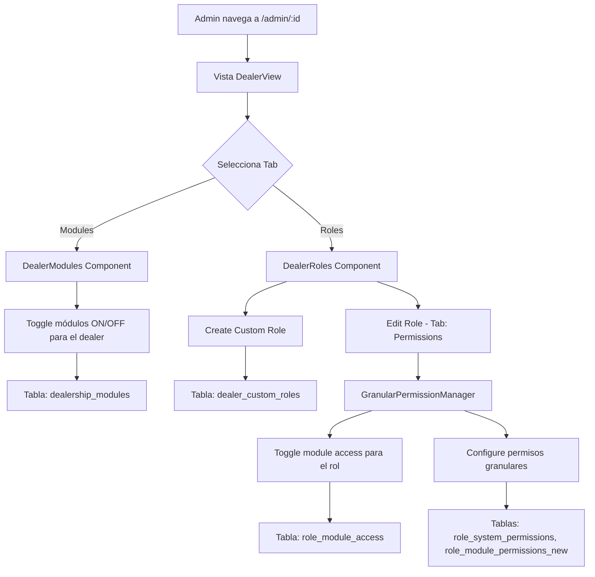
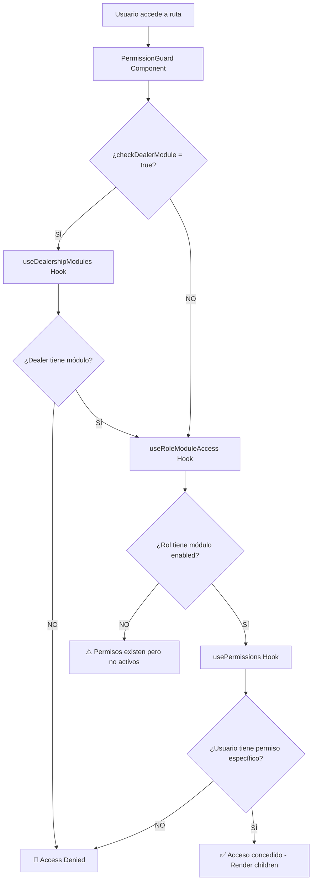

# 🛡️ Custom Roles & Permissions System - Comprehensive Review

**Fecha:** 2025-10-27
**Estado:** Sistema de permisos granulares implementado

## 📋 Índice
1. [Arquitectura General](#arquitectura-general)
2. [Flujo de Permisos](#flujo-de-permisos)
3. [Componentes Clave](#componentes-clave)
4. [Problemas Identificados](#problemas-identificados)
5. [Recomendaciones](#recomendaciones)

---

## 🏗️ Arquitectura General

### Niveles de Control de Permisos

El sistema tiene **3 niveles de permisos** que funcionan en cascada:

```
1. DEALERSHIP MODULES (Nivel Dealer)
   └─> ¿El dealer tiene el módulo habilitado?
       │
       ├─> NO → 🚫 Acceso denegado para TODOS los usuarios
       │
       └─> SÍ ↓

2. ROLE MODULE ACCESS (Nivel Rol)
   └─> ¿El rol tiene acceso al módulo?
       │
       ├─> NO → 🚫 Usuario puede tener permisos pero no los puede usar
       │
       └─> SÍ ↓

3. GRANULAR PERMISSIONS (Nivel Acción)
   └─> ¿El rol tiene permisos específicos dentro del módulo?
       │
       ├─> view_orders, create_orders, edit_orders, delete_orders, etc.
       │
       └─> ✅ Acceso concedido con permisos específicos
```

---

## 🔄 Flujo de Permisos

### Configuración del Sistema (Admin del Dealer)



### Verificación de Permisos en Runtime



---

## 🔑 Componentes Clave

### 1. **useDealershipModules** Hook
📁 `src/hooks/useDealershipModules.tsx`

**Propósito:** Gestiona qué módulos están habilitados a nivel DEALER

**Funcionalidad:**
- Carga módulos habilitados para un dealer específico
- RPC: `get_dealership_modules(p_dealer_id)`
- Actualiza módulos: `update_dealership_module()`
- **Política de seguridad:** Fail-closed (deniega si no hay configuración)

**Estado:**
```typescript
interface DealershipModule {
  module: AppModule;
  is_enabled: boolean;
  enabled_at: string;
  enabled_by: string | null;
}
```

**⚠️ PROBLEMA IDENTIFICADO:**
```typescript
// Línea 135-138
if (modules.length === 0) {
  console.warn(`[hasModuleAccess] ⚠️ No modules configured - DENYING ${module}`);
  return false; // ✅ Correcto: fail-closed
}
```
**Pero:** Si un dealer NO tiene ningún módulo configurado, todos los accesos son denegados, incluso para system_admin.

---

### 2. **useRoleModuleAccess** Hook
📁 `src/hooks/useRoleModuleAccess.tsx`

**Propósito:** Controla qué módulos puede acceder UN ROL específico

**Funcionalidad:**
- Toggle de acceso a módulos para roles custom
- RPC: `get_role_module_access(p_role_id)`
- Toggle: `toggle_role_module_access()`
- Bulk update: `bulk_set_role_module_access()`

**⚠️ PROBLEMA IDENTIFICADO:**
```typescript
// Línea 149-156
const hasRoleModuleAccess = useCallback((module: AppModule): boolean => {
  if (moduleAccess.size === 0) {
    return true; // ❌ PROBLEMA: fail-open durante carga
  }
  return moduleAccess.get(module) ?? true; // ❌ Default true si no existe
}, [moduleAccess]);
```
**Inconsistencia:** Este hook usa fail-open mientras que `useDealershipModules` usa fail-closed.

---

### 3. **GranularPermissionManager** Component
📁 `src/components/permissions/GranularPermissionManager.tsx`

**Propósito:** UI para configurar permisos granulares de un rol

**Estructura:**
```
GranularPermissionManager
├── System Permissions (role_system_permissions)
│   ├── manage_all_users
│   ├── manage_dealer_settings
│   └── view_analytics
│
└── Module Permissions (role_module_permissions_new)
    ├── Por Módulo
    │   ├── sales_orders
    │   │   ├── view_orders
    │   │   ├── create_orders
    │   │   ├── edit_orders
    │   │   └── delete_orders
    │   └── service_orders
    │       └── ...
    │
    └── Toggle: "Enable module for this role"
        └─> Escribe a role_module_access
```

**Features:**
- ✅ Checkbox individual por permiso
- ✅ Auto-agrega prerequisitos (ej: edit requiere view)
- ✅ Validación de permisos peligrosos
- ✅ Toggle de módulo integrado en la UI
- ✅ Info alert cuando módulo disabled pero tiene permisos

---

### 4. **PermissionGuard** Component
📁 `src/components/permissions/PermissionGuard.tsx`

**Propósito:** HOC que protege rutas y componentes verificando permisos

**Lógica de Verificación:**
```typescript
// Pseudocode simplificado
function checkAccess() {
  if (checkDealerModule && !isSystemAdmin) {
    // 1. Verificar módulo del dealer
    if (!hasModuleAccess(module)) return false;
    
    // 2. Verificar que usuario tenga ALGÚN permiso en el módulo
    if (!userHasAnyModulePermission) return false;
    
    // 3. Verificar permiso específico
    return hasModulePermission(module, permission);
  }
  
  // Standard check (sin validación de dealer module)
  return hasModulePermission(module, permission);
}
```

**⚠️ PROBLEMA EN LOGS:**
Según tus logs, el error ocurre aquí:
```
🔍 [PermissionGuard] Enforcing strict module check for dealerships
📋 User has permissions in 0 modules: []
[hasModuleAccess] ⚠️ No modules configured - DENYING dealerships
```

**Causa raíz:** El usuario es `system_admin` pero `isSystemAdmin` es `false` en ese momento (se carga después).

---

## 🐛 Problemas Identificados

### 1. **Race Condition: System Admin Status**
**Archivo:** `src/components/permissions/PermissionGuard.tsx:53`

```typescript
const isSystemAdmin = (enhancedUser as any)?.is_system_admin || false;
```

**Problema:** 
- `enhancedUser` se carga asíncronamente
- PermissionGuard verifica permisos ANTES de que `is_system_admin` esté disponible
- Resultado: System admins ven "Access Denied" temporalmente

**Evidencia en logs:**
```
14:49:34.086 - hasUser: true, loading: false, isSystemAdmin: false
14:49:34.661 - hasUser: true, loading: false, isSystemAdmin: false
14:49:34.818 - isSystemAdmin: true ✅ (Ahora sí cargó)
```

**Solución:**
```typescript
// Opción 1: Esperar a que enhancedUser esté cargado
if (!enhancedUser) {
  return <LoadingSkeleton />;
}

// Opción 2: Bypass para system_admin
const isSystemAdmin = enhancedUser?.is_system_admin || 
                      enhancedUser?.role === 'system_admin';

if (isSystemAdmin) {
  return <>{children}</>; // Bypass completo
}
```

---

### 2. **Inconsistencia: Fail-Open vs Fail-Closed**

| Hook/Component | Política | Línea | Riesgo |
|---|---|---|---|
| `useDealershipModules.hasModuleAccess` | **Fail-closed** ✅ | 135-138 | Bajo |
| `useRoleModuleAccess.hasRoleModuleAccess` | **Fail-open** ⚠️ | 149-156 | Medio |
| `PermissionGuard` (loading) | **Fail-closed** ✅ | 74-86 | Bajo |

**Recomendación:** Unificar política de seguridad en todos los hooks (fail-closed).

---

### 3. **No Modules Configured Warning**

**Problema:**
- Cuando un dealer NO tiene módulos configurados en `dealership_modules`
- TODOS los usuarios (incluidos system_admin) son bloqueados
- Se muestra: "This should not happen - dealership may need module configuration"

**Causas posibles:**
1. Dealer nuevo sin módulos inicializados
2. Fallo en trigger de base de datos
3. Migración incompleta

**Solución:**
```typescript
// En useDealershipModules.tsx
const hasModuleAccess = useCallback((module: AppModule): boolean => {
  // ✅ Bypass para system_admin
  if (userIsSystemAdmin) {
    return true;
  }
  
  if (modules.length === 0) {
    console.warn(`[hasModuleAccess] ⚠️ No modules configured`);
    return false;
  }
  
  const moduleData = modules.find(m => m.module === module);
  return moduleData?.is_enabled || false;
}, [modules, userIsSystemAdmin]);
```

---

### 4. **Permisos Guardados pero No Activos**

**Escenario:**
1. Admin configura permisos granulares para un rol
2. Admin olvida activar el toggle "Enable [module] for this role"
3. Usuario tiene permisos pero NO puede acceder

**Evidencia:** `GranularPermissionManager.tsx:538-545`
```typescript
{!roleHasModuleAccess && checkedCount > 0 && (
  <Alert className="mb-4">
    <Info className="h-4 w-4" />
    <AlertDescription>
      This module has {checkedCount} saved permission(s) but access is currently disabled.
      Enable the toggle above to activate these permissions.
    </AlertDescription>
  </Alert>
)}
```

**Solución:** ✅ Ya está implementado el warning. Consideración: Auto-enable cuando se asignan permisos.

---

## ✅ Recomendaciones

### Prioridad Alta

1. **Arreglar Race Condition de System Admin**
   ```typescript
   // PermissionGuard.tsx
   const isSystemAdmin = enhancedUser?.is_system_admin || 
                         enhancedUser?.role === 'system_admin';
   
   // Bypass temprano para system_admin
   if (isSystemAdmin) {
     return <>{children}</>;
   }
   ```

2. **Unificar Política Fail-Closed**
   ```typescript
   // useRoleModuleAccess.tsx - Línea 149
   const hasRoleModuleAccess = useCallback((module: AppModule): boolean => {
     if (moduleAccess.size === 0) {
       return false; // ✅ Cambiar a fail-closed
     }
     return moduleAccess.get(module) ?? false; // ✅ Default false
   }, [moduleAccess]);
   ```

3. **Agregar Loading State para Enhanced User**
   ```typescript
   // PermissionGuard.tsx - Antes de checkear permisos
   if (loading || !enhancedUser) {
     return <FullPageSkeleton />;
   }
   ```

### Prioridad Media

4. **Auto-Initialize Dealer Modules**
   - Verificar que el trigger de DB inicializa módulos
   - Backfill para dealers existentes sin configuración

5. **Auto-Enable Module on Permission Assignment**
   ```typescript
   // GranularPermissionManager.tsx
   const toggleModulePermission = async (module, permKey) => {
     // Asignar permiso
     await assignPermission();
     
     // Auto-enable módulo si está disabled
     if (!roleHasModuleAccess(module)) {
       await toggleModuleAccess(module, true);
     }
   };
   ```

6. **Mejorar Mensajes de Error**
   - En lugar de "Access Denied" genérico
   - Especificar: "Module not enabled for dealer" vs "Role lacks permission"

### Prioridad Baja

7. **Dashboard de Auditoría de Permisos**
   - Vista para ver todos los roles y sus permisos
   - Matriz: Roles × Módulos × Permisos

8. **Bulk Operations**
   - Clonar permisos de un rol a otro
   - Template roles (starter packs)

9. **Testing**
   - Unit tests para hooks de permisos
   - E2E tests para flujo completo

---

## 📊 Estado del Sistema

### ✅ Funcionalidades Implementadas

- [x] CRUD de custom roles por dealer
- [x] Permisos granulares (system + module)
- [x] Toggle de módulos a nivel dealer
- [x] Toggle de módulos a nivel rol
- [x] UI completa de gestión (GranularPermissionManager)
- [x] PermissionGuard con soporte multi-nivel
- [x] Validación de prerequisitos
- [x] Warnings de permisos inactivos
- [x] Soft delete de roles
- [x] Prevención de borrado si hay usuarios asignados

### ⚠️ Issues Pendientes

- [ ] Race condition: system_admin check
- [ ] Inconsistencia fail-open/fail-closed
- [ ] No modules configured para dealers nuevos
- [ ] Flash de "Access Denied" durante carga

### 🎯 Performance

- ✅ React.memo en PermissionGuard
- ✅ useCallback en hooks
- ✅ Skeleton loading states
- ⚠️ Múltiples queries en cascada (podría optimizarse con RPC)

---

## 🗄️ Esquema de Base de Datos

### Tablas Principales

```sql
-- Módulos habilitados por dealer
dealership_modules (
  dealer_id, module, is_enabled, enabled_at, enabled_by
)

-- Roles custom por dealer
dealer_custom_roles (
  id, dealer_id, role_name, display_name, description, is_active
)

-- Toggle de módulos por rol
role_module_access (
  role_id, module, is_enabled, created_at, updated_at
)

-- Permisos de sistema por rol
role_system_permissions (
  role_id, permission_id
)

-- Permisos granulares por rol y módulo
role_module_permissions_new (
  role_id, permission_id
)

-- Definición de permisos de sistema
system_permissions (
  id, permission_key, display_name, description, category
)

-- Definición de permisos por módulo
module_permissions (
  id, module, permission_key, display_name, description
)

-- Asignación de roles a usuarios
user_custom_role_assignments (
  user_id, custom_role_id, is_active
)
```

---

## 🔍 Debugging Tips

### 1. Verificar permisos de un usuario
```typescript
const { enhancedUser } = usePermissions();
console.log('System Admin:', enhancedUser?.is_system_admin);
console.log('Module Permissions:', enhancedUser?.module_permissions);
console.log('System Permissions:', enhancedUser?.system_permissions);
```

### 2. Verificar módulos del dealer
```typescript
const { modules, hasModuleAccess } = useDealershipModules(dealerId);
console.log('Dealer Modules:', modules);
console.log('Has dealerships module:', hasModuleAccess('dealerships'));
```

### 3. Verificar módulos del rol
```typescript
const { moduleAccess, hasRoleModuleAccess } = useRoleModuleAccess(roleId);
console.log('Role Module Access:', moduleAccess);
console.log('Role has dealerships:', hasRoleModuleAccess('dealerships'));
```

---

## 📝 Notas Adicionales

- El sistema está BIEN diseñado arquitectónicamente
- Los problemas son de **timing** y **race conditions**, no de lógica
- La solución es simple: asegurar que `enhancedUser` esté cargado antes de verificar
- Considerar agregar un `usePermissionsReady()` hook que devuelva un booleano

