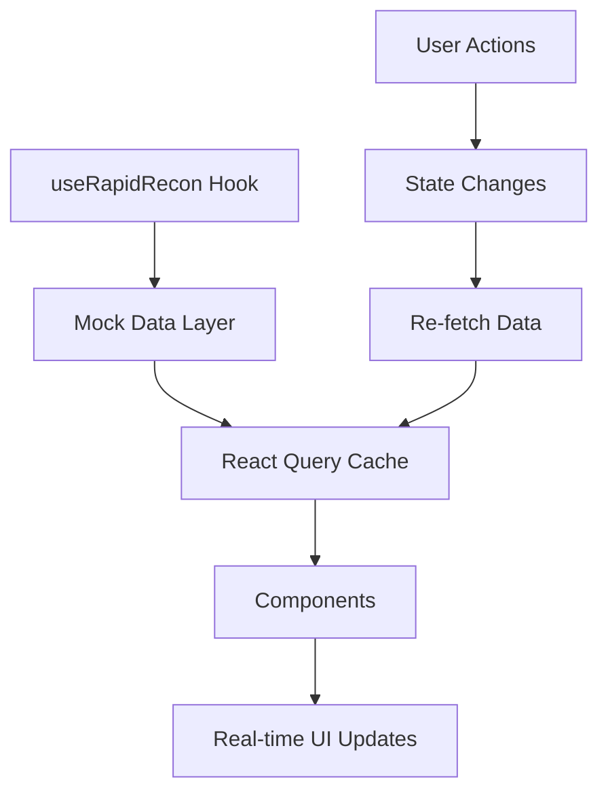

# 🚀 Get Ready - Workflow Optimizado | Guía de Implementación

## 📋 Resumen Ejecutivo

Hemos transformado exitosamente el módulo **Get Ready** en un sistema completo de workflow optimizado de reacondicionamiento vehicular, implementando todas las funcionalidades solicitadas con el branding correcto.

---

## 🎯 Características Implementadas

### 1. **🏗️ Arquitectura Modular**
```
src/
├── types/rapidRecon.ts          # Interfaces TypeScript
├── hooks/useRapidRecon.tsx      # Hook principal con datos
└── components/get-ready/
    ├── GetReadyContent.tsx      # Layout principal
    ├── GetReadyMainView.tsx     # Vista integrada con tabs
    ├── GetReadyStepsSidebar.tsx # Sidebar con KPIs y alertas
    ├── GetReadyVehicleList.tsx  # Lista avanzada de vehículos
    ├── GetReadyWorkflowActions.tsx # Acciones de workflow
    ├── GetReadyAlerts.tsx       # Sistema de alertas
    ├── GetReadyDashboardWidget.tsx # Dashboard KPIs
    └── GetReadyExample.tsx      # Ejemplo completo de uso
```

### 2. **📊 Dashboard KPIs en Tiempo Real**
- **Time to Line (T2L)**: Seguimiento promedio vs objetivo
- **SLA Compliance**: % de cumplimiento con colores indicativos
- **Daily Throughput**: Vehículos procesados por día
- **Total Holding Cost**: Costos de retención con ROI improvement
- **Efficiency Rate**: Tasa de utilización de recursos
- **Customer Satisfaction**: Score de satisfacción del cliente

### 3. **🚨 Sistema de Alertas Avanzado**
- **Bottleneck Detection**: Identificación automática de cuellos de botella
- **SLA Warnings**: Alertas preventivas antes de incumplir SLAs
- **Critical Escalations**: Sistema de escalación automático
- **Real-time Notifications**: Indicadores visuales en tiempo real
- **Action Recommendations**: Sugerencias automáticas de mejora

### 4. **🎨 Sidebar Inteligente**
- **Header con KPIs**: T2L, SLA compliance, daily throughput
- **Quick Stats Cards**: Métricas visuales compactas
- **SLA Status Indicators**: 🟢🟡🔴 en cada step
- **Enhanced Tooltips**: Información detallada al hover
- **Capacity Tracking**: Utilización actual vs máxima
- **Cost Monitoring**: Costo por día por step

### 5. **🔍 Sistema de Filtros y Búsqueda**
- **Búsqueda Global**: Por stock, VIN, make/model, assigned
- **Filtro por Step**: Todos los pasos del proceso
- **Filtro por Workflow**: Standard, Express, Priority
- **Filtro por Prioridad**: Low, Normal, High, Urgent
- **Ordenamiento**: Por múltiples campos (DIS, DTF, T2L, etc.)
- **Vista Table/Grid**: Dos modos de visualización

### 6. **⚡ Acciones de Workflow**
- **Quick Actions**: Advance All, Quality Check, Reassign Tasks
- **Priority Actions**: Resolve Bottlenecks, Handle SLA Alerts
- **Workflow Optimization**: Análisis y mejoras automáticas
- **Resource Management**: Balanceo de carga del equipo
- **Performance Review**: Métricas de rendimiento detalladas

### 7. **🌐 Soporte Multiidioma**
```json
// Traducciones completas en 3 idiomas
get_ready: {
  title: "Get Ready",
  subtitle: "Flujo de trabajo optimizado...",
  kpis: { /* KPIs metrics */ },
  alerts: { /* Alert messages */ },
  workflow: { /* Workflow types */ },
  dashboard: { /* Dashboard sections */ }
}
```

### 8. **📱 Diseño Responsive**
- **Auto-collapse Sidebar**: Se colapsa automáticamente en pantallas < 768px
- **Adaptive Grid Layouts**: Se ajusta según el tamaño de pantalla
- **Touch-friendly Controls**: Optimizado para dispositivos táctiles
- **Progressive Enhancement**: Funciona en todos los dispositivos

---

## 🛠️ Cómo Usar el Módulo

### **Uso Básico**
```tsx
import { GetReadyContent } from '@/components/get-ready/GetReadyContent';

// Implementación simple
<GetReadyContent />
```

### **Con Ejemplo Completo**
```tsx
import { GetReadyExample } from '@/components/get-ready/GetReadyExample';

// Ejemplo con documentación incluida
<GetReadyExample />
```

### **Componentes Individuales**
```tsx
import { GetReadyDashboardWidget } from '@/components/get-ready/GetReadyDashboardWidget';
import { GetReadyVehicleList } from '@/components/get-ready/GetReadyVehicleList';

// Usar componentes por separado
<GetReadyDashboardWidget />
<GetReadyVehicleList searchQuery="" selectedStep="all" /* ... */ />
```

---

## 📊 Datos Mock Incluidos

### **Steps Avanzados**
```typescript
{
  id: 'inspection',
  name: 'Inspection',
  sla_hours: 48,
  current_capacity: 3,
  max_capacity: 5,
  cost_per_day: 25,
  // ... más campos
}
```

### **KPIs de Rendimiento**
```typescript
{
  avgT2L: 8.5,
  targetT2L: 7.0,
  slaCompliance: 0.85,
  dailyThroughput: 3.2,
  totalHoldingCosts: 12500,
  // ... más métricas
}
```

### **Alertas del Sistema**
```typescript
{
  step_id: 'mechanical',
  severity: 'high',
  vehicle_count: 2,
  recommended_action: 'Consider adding additional mechanic...'
}
```

---

## 🎨 Características de UI/UX

### **Indicadores Visuales**
- ✅ **Green**: On Track / Normal
- ⚠️ **Yellow**: At Risk / Warning
- 🚨 **Red**: Critical / Urgent
- 📊 **Progress Bars**: Para métricas y utilización
- 🎯 **Badges**: Para prioridad y workflow type

### **Interacciones**
- **Hover Effects**: Tooltips informativos
- **Click Actions**: Dropdown menus con opciones
- **Real-time Updates**: Datos que se actualizan automáticamente
- **Smooth Transitions**: Animaciones suaves entre estados

### **Responsive Behavior**
- **Desktop**: Vista completa con sidebar expandida
- **Tablet**: Sidebar colapsable, grid adaptativo
- **Mobile**: Sidebar colapsada, lista vertical

---

## 🔄 Flujo de Datos



---

## 🚀 Próximos Pasos Sugeridos

### **Integración con Backend**
1. Reemplazar datos mock con API calls reales
2. Implementar WebSocket para updates en tiempo real
3. Configurar notificaciones push

### **Características Adicionales**
1. **Reportes Exportables**: PDF/Excel con métricas
2. **Configuración Personalizable**: SLA thresholds, alertas
3. **Bulk Actions**: Operaciones masivas en vehículos
4. **Historical Analytics**: Tendencias y comparaciones

### **Optimizaciones**
1. **Lazy Loading**: Para listas grandes de vehículos
2. **Virtualization**: Para performance con muchos items
3. **Caching Strategies**: Optimizar React Query
4. **Error Boundaries**: Manejo robusto de errores

---

## ✨ Resultado Final

El módulo **Get Ready** ha sido transformado en un **sistema completo de workflow optimizado** que incluye:

- 🎯 **Dashboard KPIs** con métricas en tiempo real
- 🚨 **Sistema de alertas** proactivo y inteligente
- 🔍 **Filtros avanzados** para manejo eficiente de datos
- ⚡ **Acciones de workflow** para optimización continua
- 📱 **Diseño responsive** optimizado para todos los dispositivos
- 🌐 **Soporte multiidioma** completo (ES, EN, PT-BR)
- 🛠️ **Arquitectura modular** fácil de mantener y extender

**¡El workflow optimizado de reacondicionamiento está listo para usar!** 🏆

---

## 🆘 Soporte

Para cualquier duda o personalización adicional:
- Todos los componentes están documentados con TypeScript
- Ejemplos de uso incluidos en cada archivo
- Datos mock configurables para testing
- Arquitectura modular para fácil extensión

**¡Feliz reconditioning! 🚗✨**


