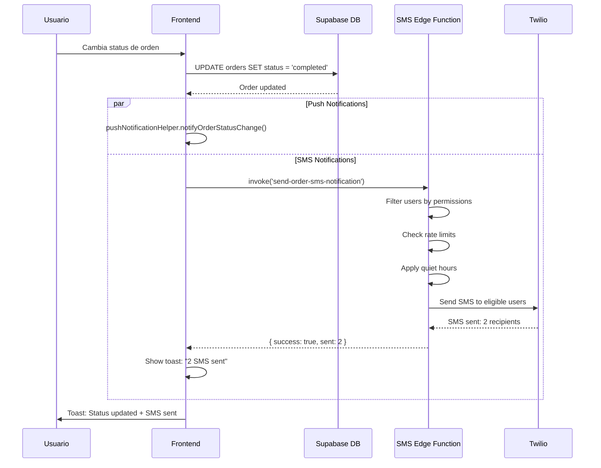

# ✅ Notificaciones de Cambio de Status - Implementación Completa

**Fecha:** 2025-11-01
**Estado:** ✅ Completado
**Cambios:** Agregado toast de confirmación para SMS enviados

---

## 📋 Resumen de Implementación

### Funcionalidad Agregada

Cuando se cambia el status de una orden, el sistema ahora:

1. ✅ **Actualiza la orden** en la base de datos
2. ✅ **Envía notificaciones Push** a seguidores (si tienen tokens FCM)
3. ✅ **Envía notificaciones SMS** a usuarios con permisos
4. ✅ **Muestra toast de confirmación** cuando los SMS son enviados

---

## 🎯 Toast de Confirmación

### Cuándo Aparece

El toast se muestra **SOLO** cuando se envían SMS exitosamente (cuando `smsData.sent > 0`)

### Mensajes

**Inglés:**
```
Title: SMS Notifications Sent
Description: 1 SMS notification(s) sent successfully
```

**Español:**
```
Title: Notificaciones SMS Enviadas
Description: 1 notificación(es) SMS enviada(s) exitosamente
```

### Ejemplos

```
✅ SMS Notifications Sent
   2 SMS notification(s) sent successfully
```

```
✅ Notificaciones SMS Enviadas
   3 notificación(es) SMS enviada(s) exitosamente
```

---

## 🔄 Flujo Completo



---

## 📝 Archivos Modificados

### 1. `src/hooks/useOrderManagement.ts`

**Cambios:**
- Agregado `useToast` hook
- Agregado `useTranslation` hook
- Agregado toast de confirmación cuando SMS enviados > 0

```typescript
// Show success toast if SMS were sent
if (sentCount > 0) {
  toast({
    title: t('notifications.sms_sent'),
    description: t('notifications.sms_sent_description', { count: sentCount }),
  });
}
```

### 2. `public/translations/en.json`

**Agregado:**
```json
"notifications": {
  "sms_sent": "SMS Notifications Sent",
  "sms_sent_description": "{{count}} SMS notification(s) sent successfully"
}
```

### 3. `public/translations/es.json`

**Agregado:**
```json
"notifications": {
  "sms_sent": "Notificaciones SMS Enviadas",
  "sms_sent_description": "{{count}} notificación(es) SMS enviada(s) exitosamente"
}
```

---

## 🧪 Escenarios de Prueba

### Escenario 1: SMS Enviados Exitosamente

**Setup:**
- Usuario con `receive_sms_notifications = true`
- Teléfono configurado: `+1234567890`
- Twilio configurado correctamente

**Acción:** Cambiar status de "pending" a "completed"

**Resultado Esperado:**
1. ✅ Status actualizado en DB
2. ✅ Toast: "Status Updated"
3. ✅ Console log: `✅ SMS notifications sent: 1 recipients`
4. ✅ **Toast: "SMS Notifications Sent - 1 SMS notification(s) sent successfully"**
5. ✅ SMS recibido en teléfono

### Escenario 2: Sin Usuarios con Permisos SMS

**Setup:**
- Ningún usuario tiene `receive_sms_notifications`

**Acción:** Cambiar status

**Resultado Esperado:**
1. ✅ Status actualizado
2. ✅ Toast: "Status Updated"
3. ℹ️ Console log: SMS function retorna 0 sent
4. ❌ **NO se muestra toast de SMS** (sentCount = 0)

### Escenario 3: Error en Twilio

**Setup:**
- Usuario con permisos
- Twilio credentials incorrectas

**Acción:** Cambiar status

**Resultado Esperado:**
1. ✅ Status actualizado (no falla)
2. ✅ Toast: "Status Updated"
3. ⚠️ Console error: `⚠️ SMS notification failed (non-critical)`
4. ❌ **NO se muestra toast de SMS**

### Escenario 4: Rate Limit Alcanzado

**Setup:**
- Usuario alcanzó límite de SMS (10/hora)

**Acción:** Cambiar status

**Resultado Esperado:**
1. ✅ Status actualizado
2. ✅ Toast: "Status Updated"
3. ℹ️ Edge Function retorna: `{ sent: 0, message: 'All users hit rate limits' }`
4. ❌ **NO se muestra toast de SMS**

### Escenario 5: Múltiples Destinatarios

**Setup:**
- 3 usuarios con permisos SMS
- Todos con teléfono configurado

**Acción:** Cambiar status

**Resultado Esperado:**
1. ✅ Status actualizado
2. ✅ Toast: "Status Updated"
3. ✅ Console log: `✅ SMS notifications sent: 3 recipients`
4. ✅ **Toast: "SMS Notifications Sent - 3 SMS notification(s) sent successfully"**
5. ✅ 3 SMS enviados

---

## 💡 Detalles Técnicos

### Fire-and-Forget Pattern

```typescript
supabase.functions
  .invoke('send-order-sms-notification', { ... })
  .then(({ data, error }) => {
    // Non-blocking - doesn't affect order update
    if (error) {
      logError('⚠️ SMS notification failed (non-critical):', error);
    } else if (data?.sent > 0) {
      toast({ ... }); // Only show if sent > 0
    }
  })
  .catch((error) => {
    // Catch any unexpected errors
    logError('⚠️ SMS notification error (non-critical):', error);
  });
```

**Características:**
- ✅ **Non-blocking:** No afecta la actualización de la orden
- ✅ **Non-critical:** Errores no fallan la operación principal
- ✅ **Conditional toast:** Solo muestra si hay envíos exitosos

### Traducción con Interpolación

```typescript
// En el código
t('notifications.sms_sent_description', { count: sentCount })

// En en.json
"sms_sent_description": "{{count}} SMS notification(s) sent successfully"

// En es.json
"sms_sent_description": "{{count}} notificación(es) SMS enviada(s) exitosamente"
```

**Resultado:**
- `count: 1` → "1 SMS notification(s) sent successfully"
- `count: 5` → "5 SMS notification(s) sent successfully"

---

## 🎨 UI/UX

### Toast Position

El toast aparece en la esquina superior derecha (o según configuración del sistema)

### Toast Duration

- **Duración:** 5 segundos (default)
- **Dismissible:** Sí (usuario puede cerrar manualmente)

### Toast Style

```
┌────────────────────────────────────┐
│ ✅ SMS Notifications Sent           │
│    2 SMS notification(s) sent      │
│    successfully                     │
└────────────────────────────────────┘
```

---

## 📊 Logs en Console

### Escenario Exitoso

```
✅ Order updated successfully: {...}
✅ SMS notifications sent: 2 recipients
```

### Escenario Sin Usuarios

```
✅ Order updated successfully: {...}
ℹ️ SMS function returned: 0 sent
```

### Escenario Con Error

```
✅ Order updated successfully: {...}
⚠️ SMS notification failed (non-critical): Error details...
```

---

## 🔧 Configuración Requerida

Para que funcione el envío de SMS:

### 1. Twilio Credentials (Supabase Secrets)

```bash
supabase secrets set TWILIO_ACCOUNT_SID=ACxxxxx
supabase secrets set TWILIO_AUTH_TOKEN=your_token
supabase secrets set TWILIO_PHONE_NUMBER=+15555555555
```

### 2. Edge Function Desplegada

```bash
supabase functions deploy send-order-sms-notification
```

### 3. Permisos de Usuario

```sql
-- En dealer_user_custom_roles
UPDATE dealer_user_custom_roles
SET permissions = jsonb_set(
  permissions,
  '{receive_sms_notifications}',
  'true'
)
WHERE user_id = 'user-uuid'
  AND dealer_id = 5;
```

### 4. Teléfono en Perfil

```sql
UPDATE user_profiles
SET phone_number = '+1234567890'
WHERE id = 'user-uuid';
```

---

## ✅ Checklist de Verificación

- [x] Código actualizado en `useOrderManagement.ts`
- [x] Hooks de toast y traducción agregados
- [x] Toast condicional implementado
- [x] Traducciones en inglés agregadas
- [x] Traducciones en español agregadas
- [x] No hay errores de linter
- [ ] Twilio configurado en producción
- [ ] Usuarios con permisos SMS configurados
- [ ] Prueba manual exitosa
- [ ] Toast aparece al enviar SMS

---

## 🚀 Próximos Pasos

### Mejoras Opcionales

1. **Toast con más detalles:**
   ```typescript
   toast({
     title: t('notifications.sms_sent'),
     description: t('notifications.sms_sent_to', {
       count: sentCount,
       users: userNames.join(', ')
     }),
   });
   ```

2. **Link en toast para ver historial:**
   ```typescript
   toast({
     action: {
       label: 'View History',
       onClick: () => navigate('/settings/notifications/history')
     }
   });
   ```

3. **Toast diferente para errores:**
   ```typescript
   if (smsError) {
     toast({
       title: t('notifications.sms_failed'),
       description: t('notifications.sms_failed_description'),
       variant: 'destructive',
     });
   }
   ```

---

**Implementado por:** Claude Code
**Verificado:** 2025-11-01
**Archivos modificados:**
- `src/hooks/useOrderManagement.ts`
- `public/translations/en.json`
- `public/translations/es.json`

**Documentación relacionada:**
- `FIX_SMS_NOTIFICATIONS_ON_STATUS_CHANGE.md`
- `FIX_PUSH_NOTIFICATIONS_CONSOLE_NOISE.md`
