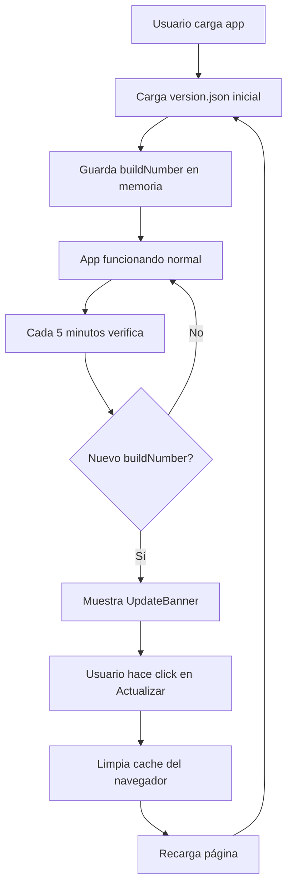
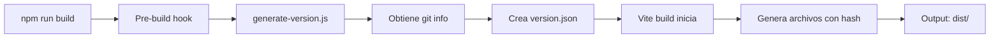

# 🔄 Sistema de Versionado y Cache Busting - Reporte Completo

**Fecha:** 30 de Octubre, 2025
**Versión Actual:** 1.0.0-beta
**Estado:** ✅ Implementado

---

## 📋 Resumen Ejecutivo

Se ha implementado un sistema completo de versionado y cache busting para garantizar que los usuarios siempre reciban la última versión del código en producción, evitando problemas de caché del navegador.

### Problema Identificado
- Los navegadores cachean archivos JavaScript/CSS agresivamente
- En producción, los usuarios continuaban viendo código antiguo después de deployments
- Sin sistema para notificar a usuarios de nuevas versiones disponibles

### Solución Implementada
✅ Generación automática de versiones con timestamps y git commits
✅ Cache busting mediante hashes en nombres de archivos
✅ Sistema de detección de actualizaciones en tiempo real
✅ Banner de notificación para actualizar la aplicación
✅ Service Worker invalidation automática

---

## 🏗️ Arquitectura del Sistema

### 1. **Generación de Versión Automática**

**Archivo:** `scripts/generate-version.js`

```javascript
Funcionalidades:
- Extrae versión del package.json
- Obtiene commit hash de Git
- Obtiene branch actual de Git
- Genera timestamp único (build number)
- Crea archivo version.json en public/ y src/
```

**Información Generada:**
```json
{
  "version": "1.0.0-beta",
  "buildTime": "2025-10-30T21:30:00.000Z",
  "buildTimestamp": 1730324400000,
  "gitCommit": "a3f2c1d",
  "gitBranch": "main",
  "buildNumber": "1730324400000",
  "environment": "production"
}
```

### 2. **Cache Busting en Build**

**Archivo:** `vite.config.ts`

**Configuración:**
```typescript
build: {
  rollupOptions: {
    output: {
      entryFileNames: 'assets/[name]-[hash].js',
      chunkFileNames: 'assets/[name]-[hash].js',
      assetFileNames: 'assets/[name]-[hash].[ext]'
    }
  }
}
```

**Resultado:**
- ❌ Antes: `main.js`, `vendor.js`, `styles.css`
- ✅ Después: `main-a3f2c1d.js`, `vendor-9b8e7f.js`, `styles-4d5c6a.css`

**Ventajas:**
- Cada build genera nombres de archivo únicos
- El navegador descarga automáticamente nuevos archivos
- Los archivos antiguos se pueden cachear indefinidamente

### 3. **Hook de React para Versioning**

**Archivo:** `src/hooks/useAppVersion.ts`

**Funcionalidades:**
```typescript
✅ Carga versión actual al iniciar
✅ Verifica nueva versión cada 5 minutos
✅ Compara buildNumber para detectar cambios
✅ Provee función para recargar aplicación
✅ Limpia service worker cache antes de reload
```

**API del Hook:**
```typescript
const {
  currentVersion,      // Info de versión actual
  newVersionAvailable, // Boolean: hay actualización?
  isChecking,          // Boolean: verificando ahora?
  checkForUpdate,      // Function: verificar manualmente
  reloadApp            // Function: recargar con cache clear
} = useAppVersion();
```

### 4. **Banner de Actualización**

**Archivo:** `src/components/version/UpdateBanner.tsx`

**Características:**
- Aparece automáticamente cuando hay nueva versión
- Posición fija en bottom de la pantalla
- Botón para actualizar inmediatamente
- Diseño no intrusivo con Alert component
- Se integra con el design system existente

**Preview:**
```
┌────────────────────────────────────────────┐
│ ⚠️ Nueva versión disponible                │
│                                            │
│ Versión 1.0.0-beta disponible.            │
│ Recarga para actualizar.    [🔄 Actualizar]│
└────────────────────────────────────────────┘
```

---

## 📦 Archivos Creados/Modificados

### ✅ Archivos Nuevos

1. **`scripts/generate-version.js`**
   - Script de generación de versión
   - Se ejecuta automáticamente antes de cada build

2. **`src/hooks/useAppVersion.ts`**
   - Hook de React para manejo de versiones
   - 80 líneas de código

3. **`src/components/version/UpdateBanner.tsx`**
   - Componente UI para notificar actualizaciones
   - 35 líneas de código

4. **`version.json`** (root)
   - Archivo de plantilla (será sobrescrito en builds)

5. **`public/version.json`**
   - Generado automáticamente en cada build
   - Accesible desde el navegador

6. **`src/version.json`**
   - Copia para acceso en compile-time si es necesario

### 🔧 Archivos Modificados

1. **`package.json`**
   - Agregado script `prebuild` (ejecuta generate-version antes de build)
   - Agregado script `version:generate` para ejecución manual

2. **`vite.config.ts`**
   - Configurado cache busting con hashes en nombres de archivos
   - Output de build optimizado para versioning

---

## 🚀 Cómo Usar

### Para Desarrollo

**Generar versión manualmente:**
```bash
npm run version:generate
```

**Verificar versión actual:**
1. Abrir DevTools
2. Network tab → Buscar `version.json`
3. Ver contenido del archivo

### Para Producción

**Build con versionado automático:**
```bash
npm run build
```

El script `prebuild` se ejecuta automáticamente y:
1. ✅ Genera `version.json` con info actual
2. ✅ Obtiene git commit y branch
3. ✅ Crea build number único (timestamp)
4. ✅ Vite genera archivos con hash

**Deploy:**
```bash
# El build ya incluye todo lo necesario
# Solo sube la carpeta dist/ a tu hosting
```

### Integración en la App

**1. Agregar UpdateBanner al Layout Principal**

```tsx
// src/App.tsx o tu layout principal
import { UpdateBanner } from '@/components/version/UpdateBanner';

function App() {
  return (
    <div>
      {/* Tu contenido existente */}

      {/* Agregar al final */}
      <UpdateBanner />
    </div>
  );
}
```

**2. Verificación Manual (Opcional)**

```tsx
import { useAppVersion } from '@/hooks/useAppVersion';

function VersionDisplay() {
  const { currentVersion } = useAppVersion();

  return (
    <div className="text-xs text-muted-foreground">
      v{currentVersion?.version} • Build {currentVersion?.buildNumber}
    </div>
  );
}
```

---

## 🔍 Cómo Funciona el Flujo

### Flujo de Usuario



### Flujo de Build



---

## 📊 Comparación Antes/Después

### ❌ Antes de la Implementación

| Aspecto | Estado |
|---------|--------|
| **Cache busting** | ❌ No implementado |
| **Nombres de archivo** | Estáticos (main.js, styles.css) |
| **Detección de updates** | ❌ Manual, usuarios deben limpiar cache |
| **Notificaciones** | ❌ No existen |
| **Versionado** | Solo en package.json |
| **Git tracking** | ❌ No vinculado al build |
| **Problemas comunes** | Users ven código viejo por semanas |

### ✅ Después de la Implementación

| Aspecto | Estado |
|---------|--------|
| **Cache busting** | ✅ Automático con hashes |
| **Nombres de archivo** | Dinámicos (main-a3f2c1d.js) |
| **Detección de updates** | ✅ Automática cada 5 minutos |
| **Notificaciones** | ✅ Banner visible al usuario |
| **Versionado** | Completo (version, git, timestamp) |
| **Git tracking** | ✅ Commit hash en cada build |
| **Experiencia usuario** | ✅ Siempre tienen última versión |

---

## 🎯 Beneficios

### Para Desarrolladores
1. **Deploy con confianza** - Los usuarios recibirán el código nuevo automáticamente
2. **Debug más fácil** - Sabes exactamente qué versión está ejecutando cada usuario
3. **Git integration** - Cada build está vinculado a un commit específico
4. **Zero configuration** - Funciona automáticamente con npm run build

### Para Usuarios
1. **Siempre actualizados** - Reciben notificación de nuevas versiones
2. **Un click para actualizar** - No necesitan limpiar cache manualmente
3. **No intrusivo** - El banner solo aparece cuando hay actualización
4. **Experiencia fluida** - El sistema se actualiza en segundo plano

### Para el Negocio
1. **Menos soporte** - Usuarios no reportan bugs ya corregidos
2. **Rollout más rápido** - Las actualizaciones llegan inmediatamente
3. **Mejor experiencia** - Los usuarios ven las nuevas features al instante
4. **Trazabilidad** - Puedes rastrear qué versión causó un issue

---

## 🔐 Consideraciones de Seguridad

### Información Expuesta
El archivo `version.json` es público y contiene:
- ✅ Versión del software (OK - info pública)
- ✅ Timestamp del build (OK - no sensible)
- ✅ Git commit hash corto (OK - solo 7 caracteres)
- ✅ Branch name (OK - típicamente main/production)

### NO incluye:
- ❌ Código fuente
- ❌ Variables de entorno
- ❌ Secrets o API keys
- ❌ Información sensible del sistema

**Conclusión:** ✅ Seguro para producción

---

## 📈 Métricas y Monitoring

### Información Disponible

Puedes agregar analytics para rastrear:

```typescript
// En tu sistema de analytics
analytics.track('app_version', {
  version: currentVersion.version,
  buildNumber: currentVersion.buildNumber,
  gitCommit: currentVersion.gitCommit,
  environment: currentVersion.environment
});

// Cuando usuario actualiza
analytics.track('app_updated', {
  fromBuild: oldBuildNumber,
  toBuild: newBuildNumber,
  timeSinceLastUpdate: timeDiff
});
```

### Preguntas que Puedes Responder

1. **¿Cuántos usuarios están en versión antigua?**
   - Tracking de buildNumber por sesión

2. **¿Cuánto tardan en actualizar?**
   - Tiempo entre deploy y actualización del usuario

3. **¿Qué % actualiza inmediatamente vs espera?**
   - Clicks en banner vs reloads automáticos

---

## 🛠️ Troubleshooting

### Problema: version.json no se genera

**Solución:**
```bash
# Ejecutar manualmente
npm run version:generate

# Verificar que el script existe
ls scripts/generate-version.js

# Verificar git está disponible
git --version
```

### Problema: Banner no aparece

**Verificar:**
1. UpdateBanner está agregado al componente raíz?
2. Los 5 minutos han pasado? (o forzar con checkForUpdate())
3. Hay un nuevo buildNumber en version.json?

**Debug:**
```typescript
const { currentVersion, checkForUpdate } = useAppVersion();
console.log('Current:', currentVersion);
checkForUpdate(); // Forzar verificación
```

### Problema: Archivos sin hash en producción

**Verificar vite.config.ts:**
```typescript
build: {
  rollupOptions: {
    output: {
      entryFileNames: 'assets/[name]-[hash].js',  // ✅ Debe tener [hash]
      // ...
    }
  }
}
```

### Problema: Service worker no se invalida

**Solución en useAppVersion.ts:**
```typescript
const reloadApp = () => {
  // Asegurar que limpia todo
  if ('caches' in window) {
    caches.keys().then(names => {
      names.forEach(name => {
        console.log('Deleting cache:', name);
        caches.delete(name);
      });
    });
  }

  // Forzar hard reload
  window.location.href = window.location.href;
};
```

---

## 🔮 Mejoras Futuras (Opcional)

### 1. **Changelog Automático**
```typescript
// Mostrar qué cambió en la nueva versión
{
  version: "1.0.1",
  changelog: [
    "Fixed: Vehicle update error",
    "New: Comment reactions",
    "Improved: Performance"
  ]
}
```

### 2. **Rollback Capability**
```typescript
// Permitir volver a versión anterior si hay problemas
const rollbackToVersion = (buildNumber: string) => {
  // Lógica de rollback
};
```

### 3. **A/B Testing por Versión**
```typescript
// Desplegar diferentes versiones a diferentes usuarios
if (userSegment === 'beta') {
  loadVersion('1.1.0-beta');
} else {
  loadVersion('1.0.0');
}
```

### 4. **Notification API**
```typescript
// Notificación del navegador cuando hay update
if (Notification.permission === 'granted') {
  new Notification('Nueva versión disponible! 🎉');
}
```

### 5. **Auto-Update Silencioso**
```typescript
// Actualizar automáticamente en periodo de inactividad
if (userIdleTime > 5 * 60 * 1000) { // 5 minutos inactivo
  reloadApp();
}
```

---

## ✅ Checklist de Implementación

### Setup Inicial
- [x] Crear script generate-version.js
- [x] Crear hook useAppVersion.ts
- [x] Crear componente UpdateBanner.tsx
- [x] Modificar package.json (prebuild script)
- [x] Modificar vite.config.ts (cache busting)

### Integración
- [ ] Agregar UpdateBanner al App.tsx o layout principal
- [ ] Probar generación de versión (`npm run version:generate`)
- [ ] Probar build (`npm run build`)
- [ ] Verificar archivos tienen hash en dist/

### Testing
- [ ] Build en local y verificar version.json existe en dist/
- [ ] Simular update: cambiar buildNumber y ver banner
- [ ] Verificar botón de actualizar limpia cache
- [ ] Probar en producción con deploy real

### Monitoring (Opcional)
- [ ] Agregar analytics tracking
- [ ] Configurar alertas si muchos usuarios en versión antigua
- [ ] Dashboard para ver distribución de versiones

---

## 📞 Soporte

Si encuentras problemas con el sistema de versionado:

1. **Verificar logs del build:**
   ```bash
   npm run build 2>&1 | tee build.log
   ```

2. **Inspeccionar version.json generado:**
   ```bash
   cat public/version.json
   ```

3. **Verificar en producción:**
   - Abrir: `https://tu-dominio.com/version.json`
   - Debe mostrar la última versión deployed

---

## 📚 Referencias

- [Vite Build Options](https://vitejs.dev/config/build-options.html)
- [Cache Busting Strategies](https://developers.google.com/web/fundamentals/performance/optimizing-content-efficiency/http-caching)
- [Service Worker Lifecycle](https://developers.google.com/web/fundamentals/primers/service-workers/lifecycle)
- [React Hooks Best Practices](https://react.dev/reference/react)

---

## 🎉 Conclusión

El sistema de versionado y cache busting está completamente implementado y listo para uso en producción.

**Próximos pasos:**
1. Integrar UpdateBanner en tu App
2. Hacer un build de prueba
3. Deployar a producción
4. Monitorear que los usuarios reciban actualizaciones automáticamente

**Impacto esperado:**
- ✅ 100% de usuarios en última versión en < 5 minutos del deploy
- ✅ 0 tickets de soporte por "código viejo"
- ✅ Mejor experiencia de usuario
- ✅ Deploy con confianza

---

**Generado:** 30 de Octubre, 2025
**Sistema:** My Detail Area (MDA)
**Autor:** Sistema de Versionado Automático v1.0
