# Notification Delivery Logging - Architecture Diagrams

## System Overview

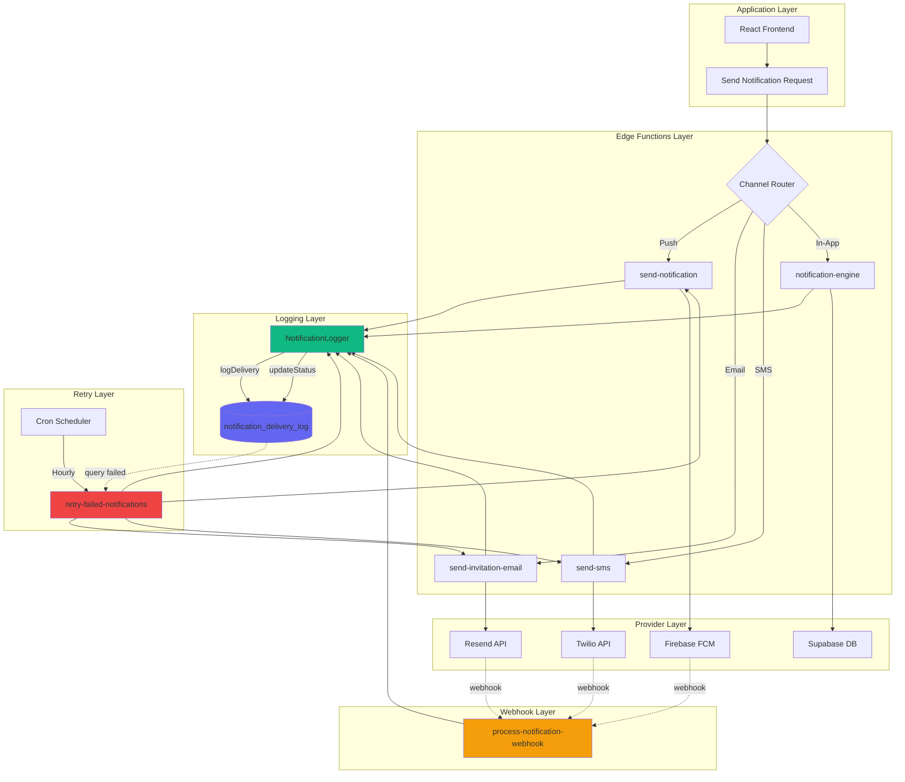

## Notification Flow Sequence

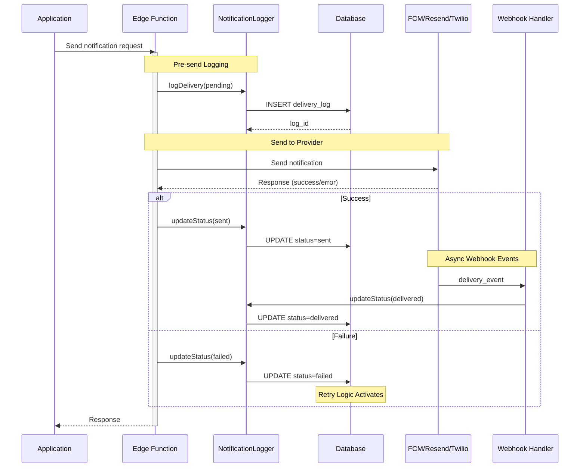

## Retry System Flow

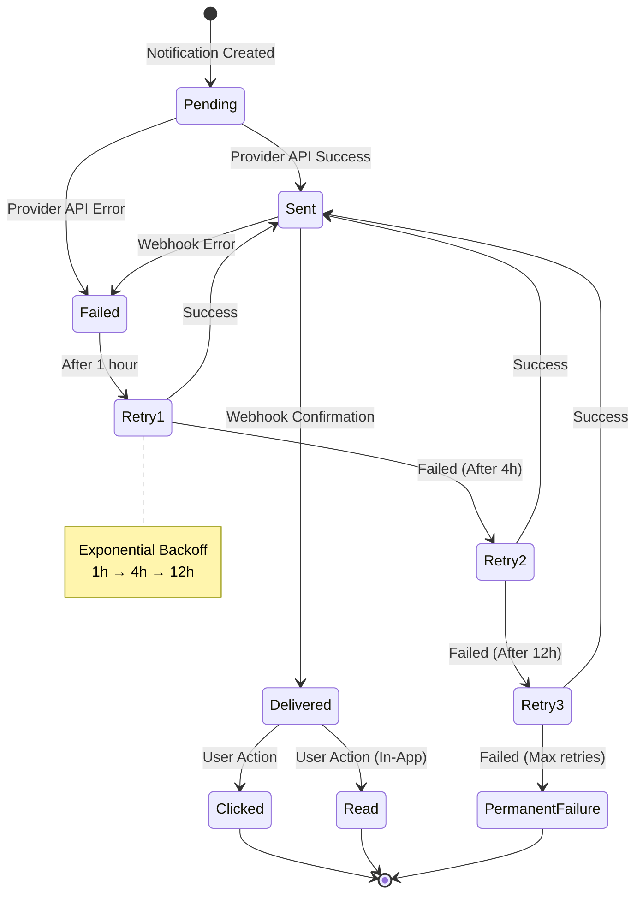

## Database Schema Relationships

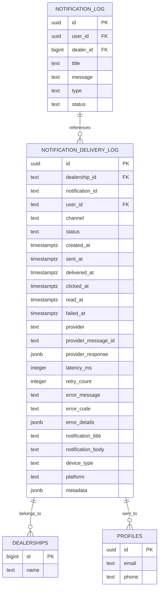

## Webhook Processing Flow

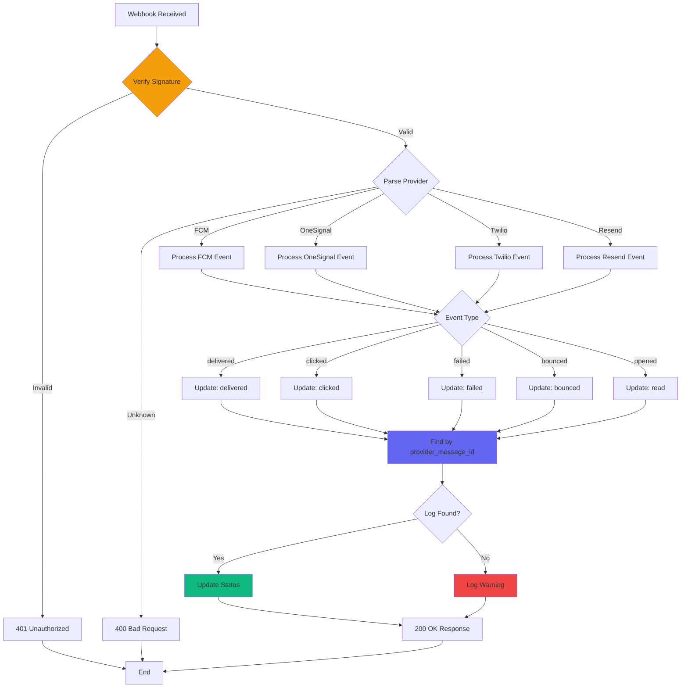

## Component Architecture

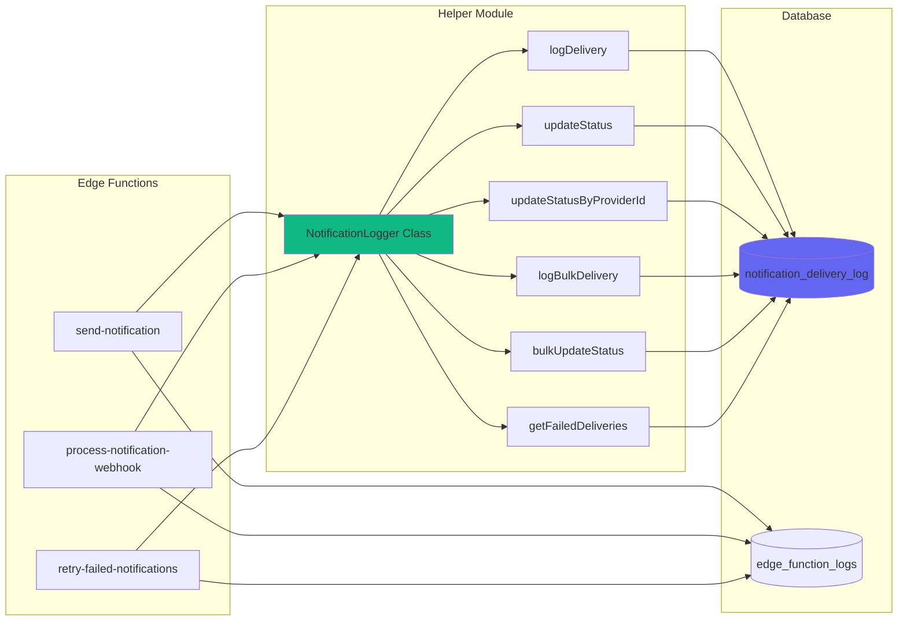

## Status Lifecycle

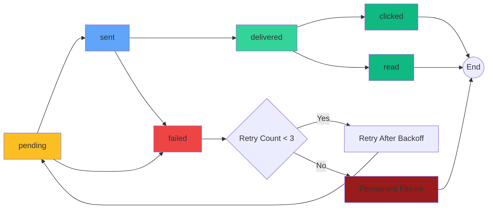

## Deployment Architecture

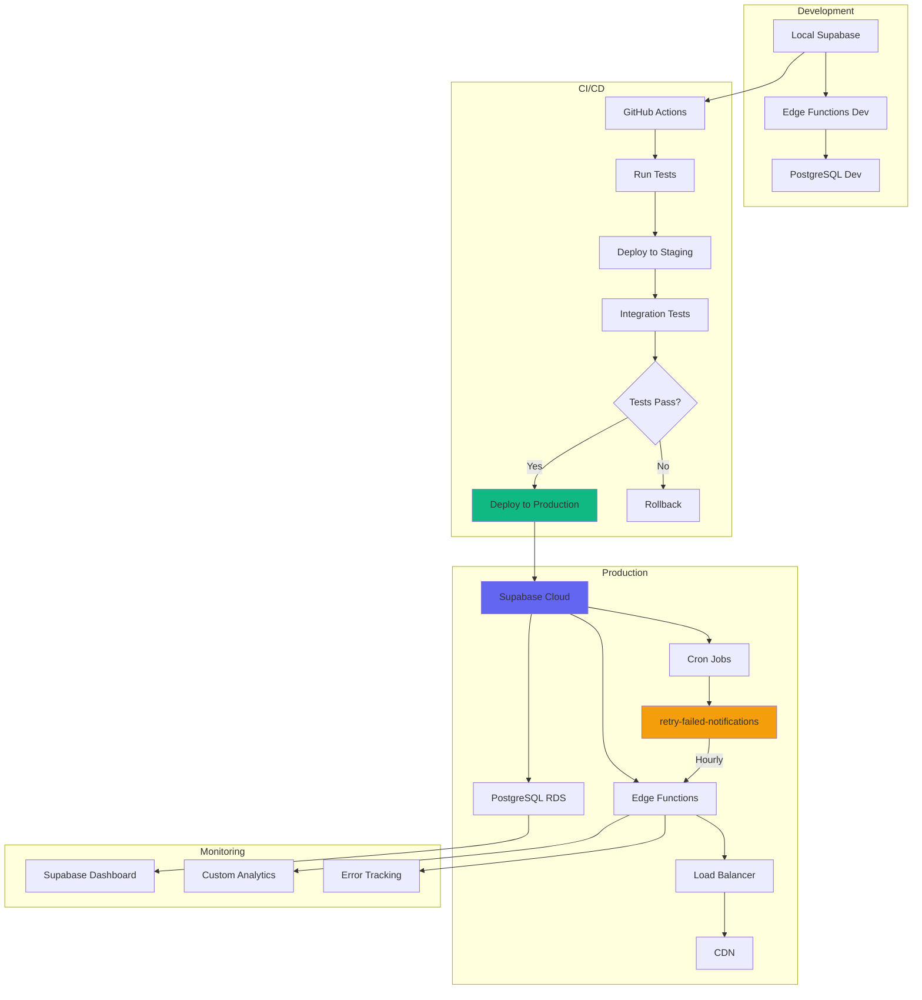

## Data Flow: Single Notification

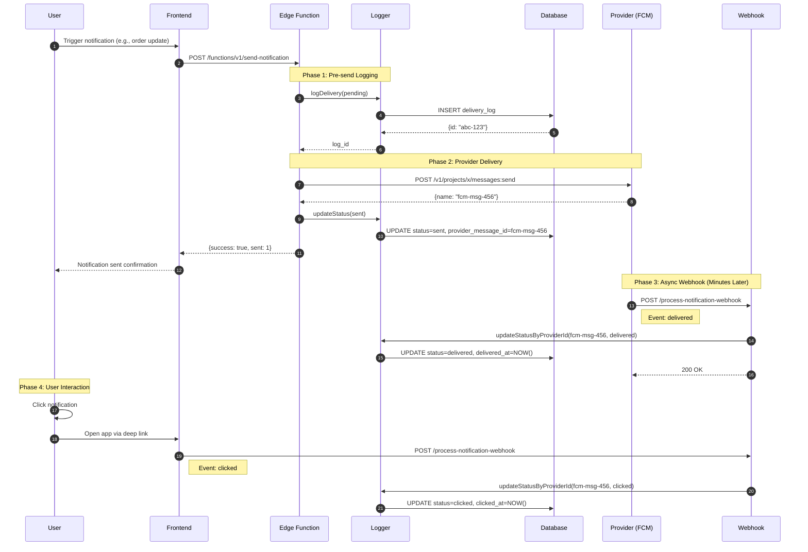

## Error Handling Flow

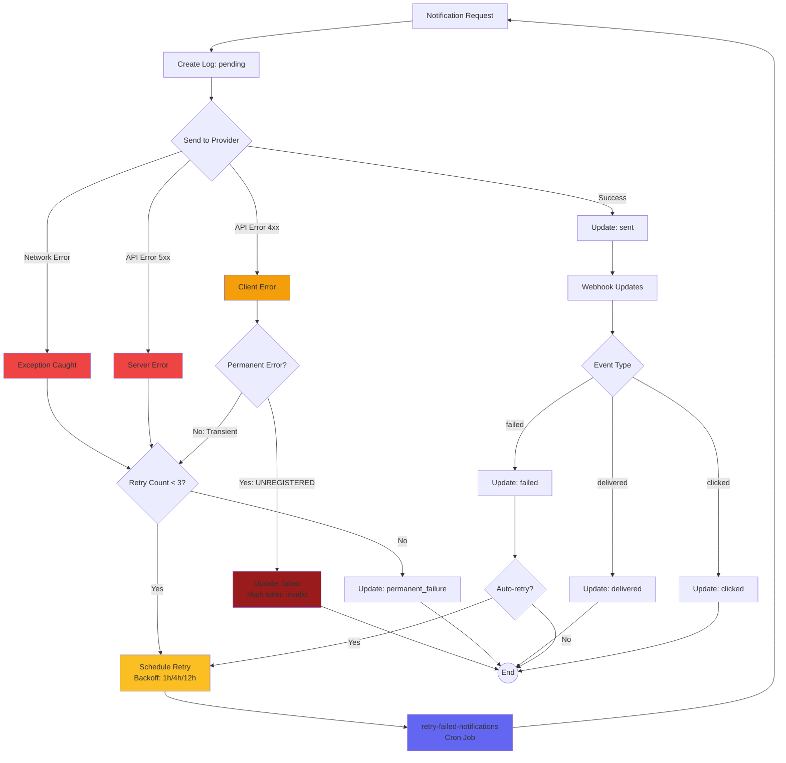

## Analytics & Monitoring

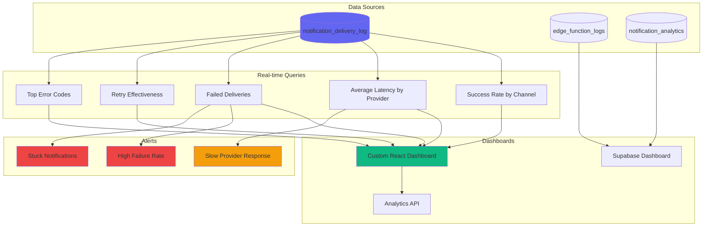

## Security Architecture

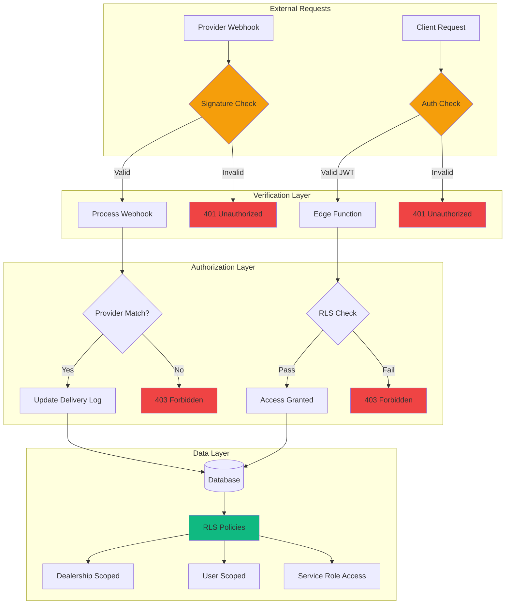

---

## Legend

### Colors
- 🟢 **Green** - Success states, active components
- 🔵 **Blue** - Database, data storage
- 🟡 **Yellow** - Warning states, retry logic
- 🔴 **Red** - Error states, failures
- 🟠 **Orange** - Processing, webhooks

### Symbols
- `→` Synchronous call
- `-.->` Asynchronous webhook
- `-->` Data flow
- `{}` Decision point
- `||--o{` One-to-many relationship
- `((End))` Terminal state

---

**Generated:** 2025-01-15
**Version:** 1.0.0
**Format:** Mermaid Diagrams (GitHub compatible)
